# 🚀 SAP CPI – Integração com Request-Reply & Content Enricher (OData)
## SAP BTP CPI - ODATA_ENRICHMENT

No dia a dia das empresas, é muito comum a necessidade de integrar diferentes sistemas para consolidar informações e apoiar processos de negócio.

Neste cenário, demonstro como utilizar os componentes Request-Reply e Content Enricher no SAP Cloud Integration para construir uma integração eficiente baseada em serviços OData.

🎯 Problema de Negócio

Imagine um cenário onde:

Um sistema fornece dados de produtos
Outro sistema contém informações de fornecedores
E uma aplicação precisa de tudo isso junto para exibir ou processar dados

👉 O desafio é:
Como consolidar essas informações em tempo real?

🧩 Solução Proposta

A solução utiliza dois padrões clássicos de integração:

🔹 Request-Reply

Responsável por buscar os dados principais (produtos) em um serviço externo.

🔹 Content Enricher

Responsável por complementar os dados com informações adicionais (fornecedores).


### Criando o Package


<br>

### Nome do Package
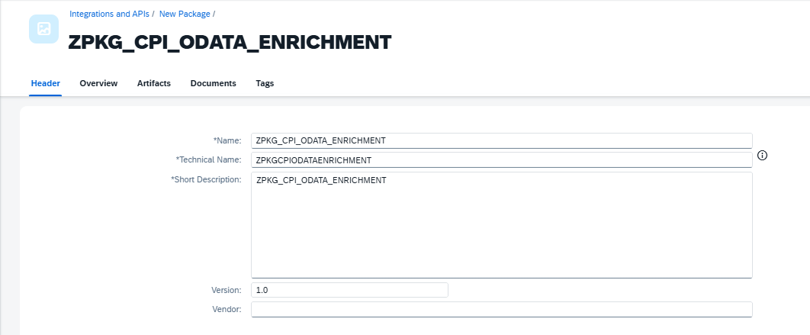
```
ZPKG_CPI_ODATA_ENRICHMENT
```
<br>

## 🧩 Criação do Integration Flow

### Adicionando o Artefato
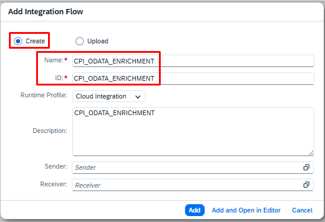
```
CPI_ODATA_ENRICHMENT
```

<br>

## HTTPS
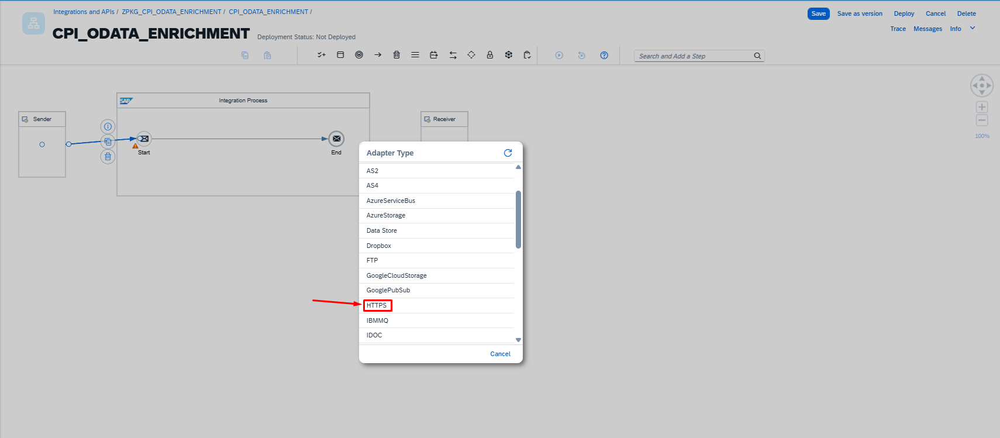


<br>

### Adicionando o Endpoint
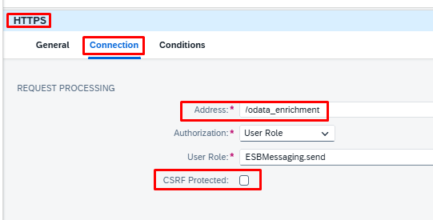
```
/odata_enrichment
```

<br>

## Request Replay
Adicionando o Request Replay
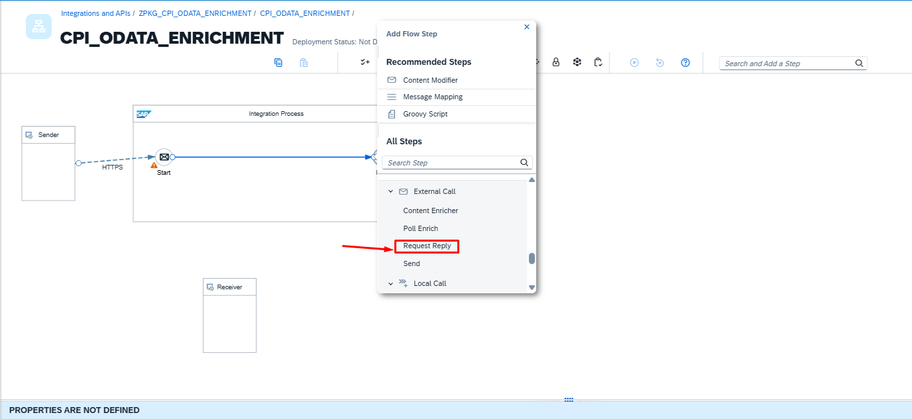

<br>

### Adicionando o ODATA
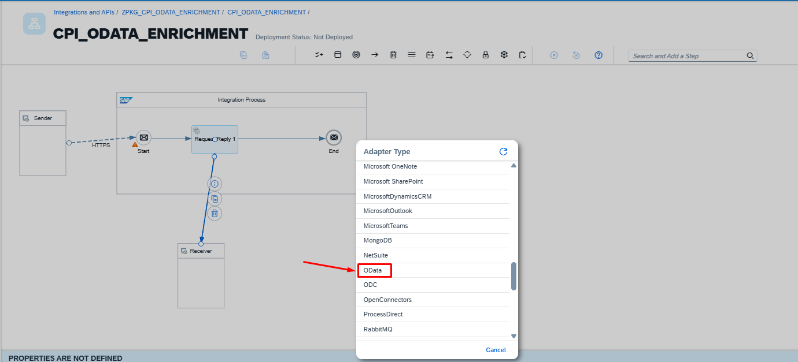

<br>

### Selecionando o OData V2
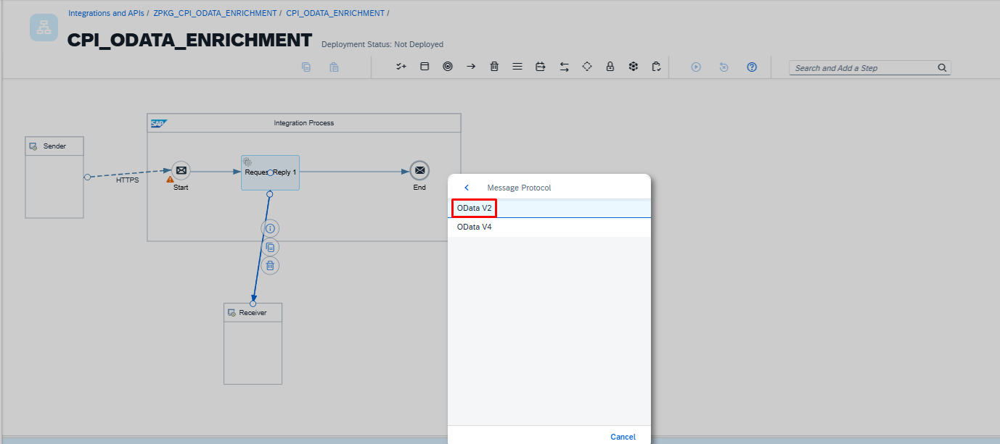

<br>

### Nome do iFlow
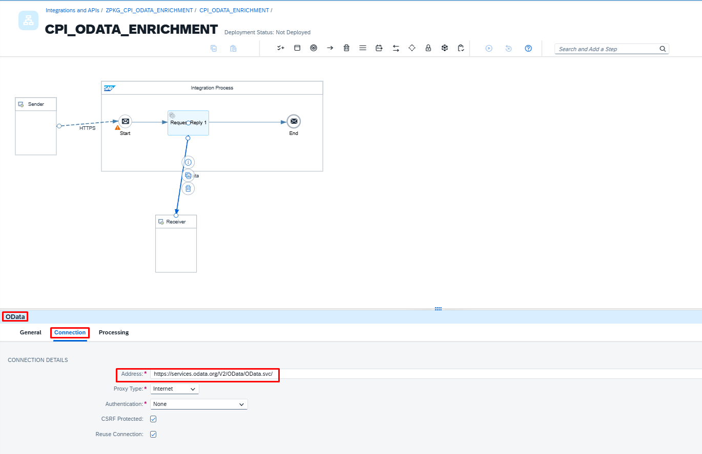
```
https://services.odata.org/V2/OData/OData.svc/
```

<br>

### Nome do iFlow
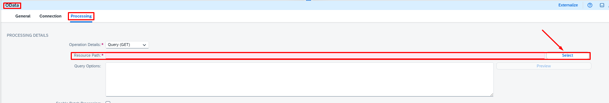

<br>

### Nome do iFlow
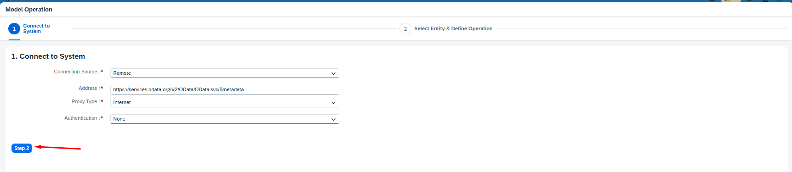

<br>

### Nome do iFlow
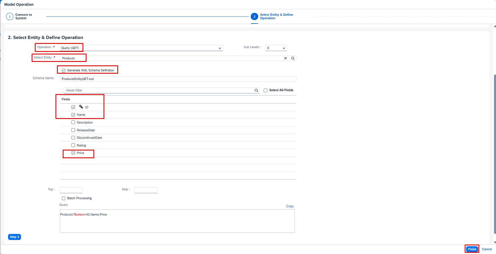

<br>

### Nome do iFlow
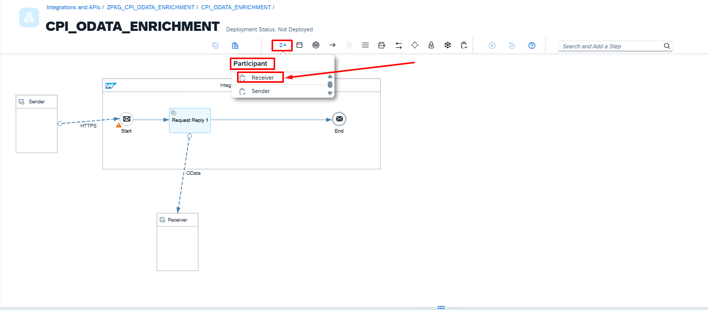

<br>

### Nome do iFlow
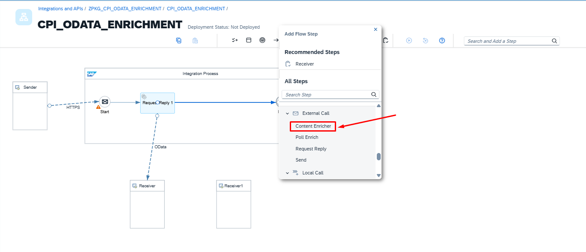


<br>

### Nome do iFlow
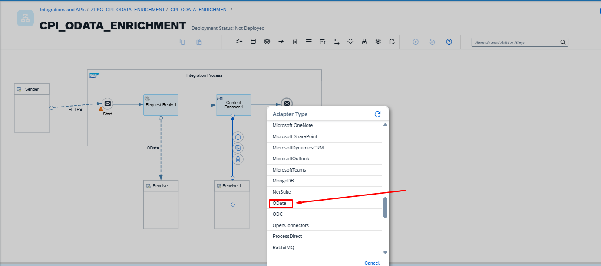

<br>

### Nome do iFlow
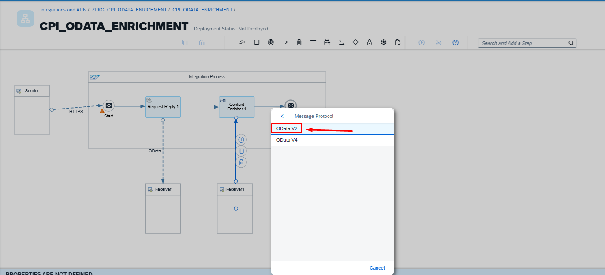

<br>

### Nome do iFlow
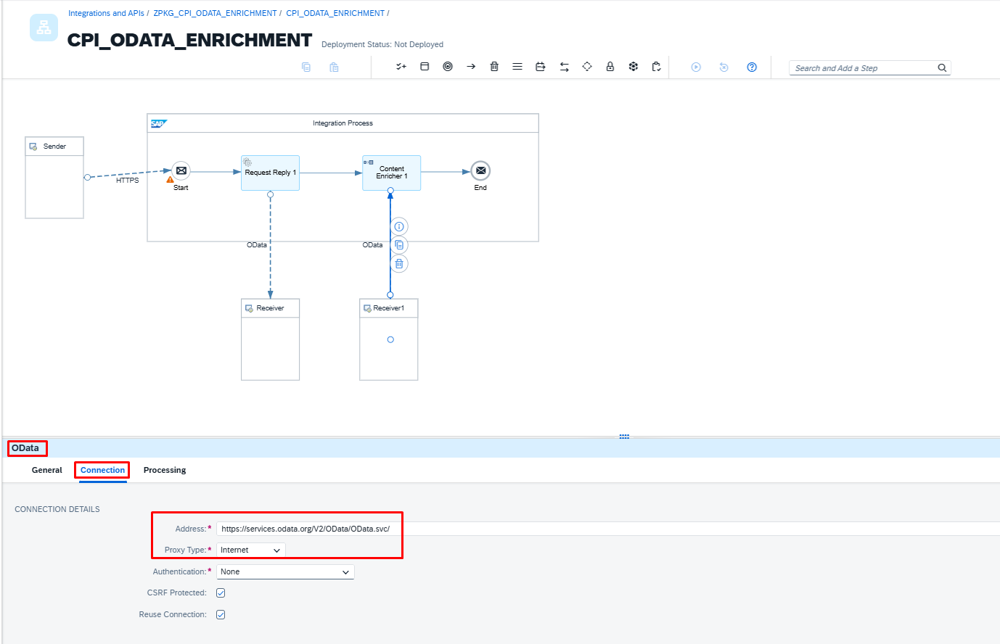

<br>

### Nome do iFlow
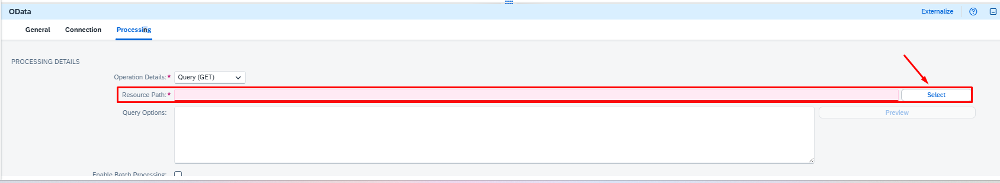

<br>

### Nome do iFlow
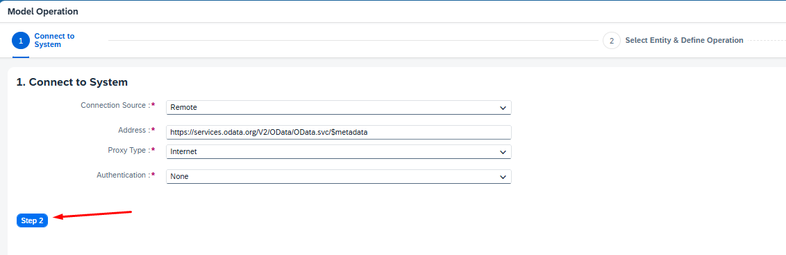

<br>

### Nome do iFlow
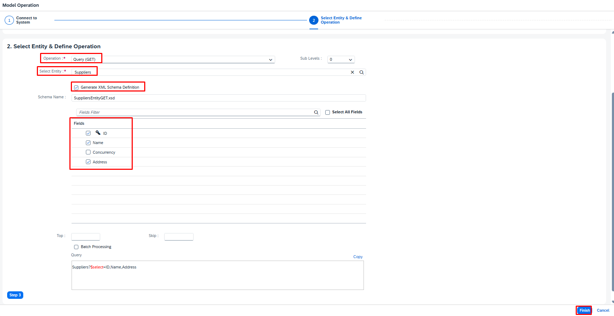

<br>

### Nome do iFlow
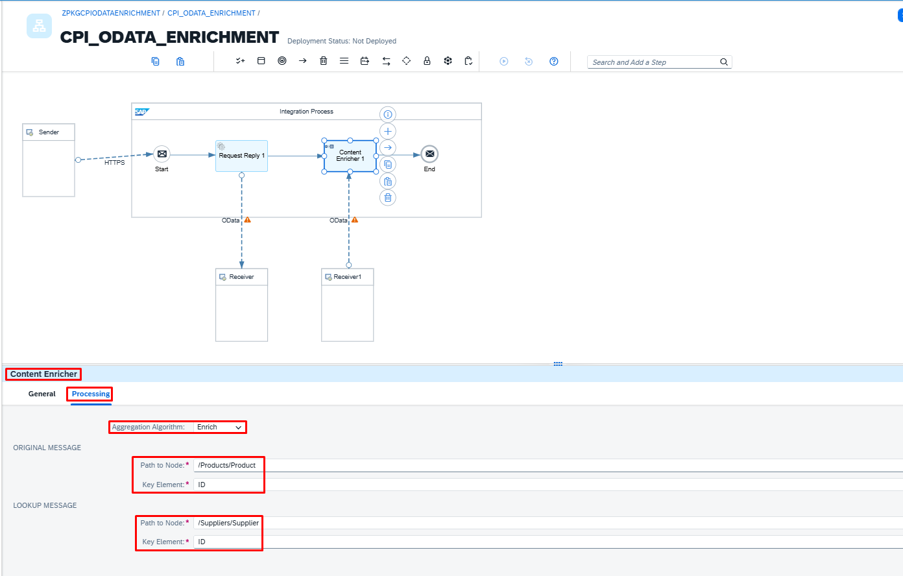

<br>

### Nome do iFlow
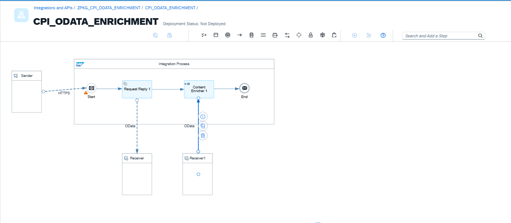

<br>

### Nome do iFlow
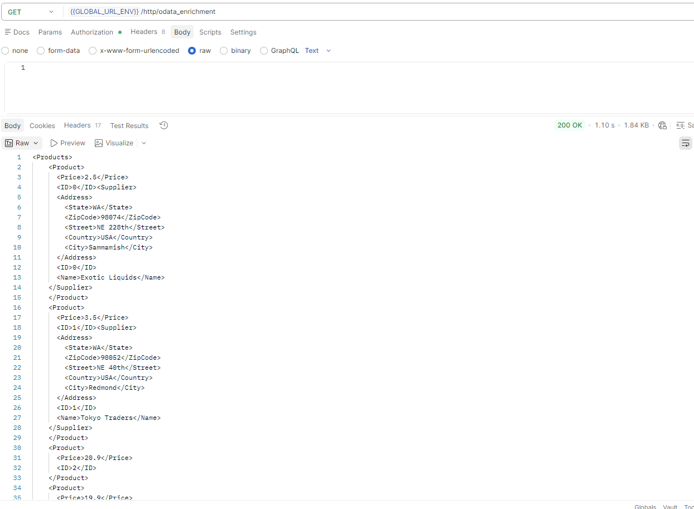


